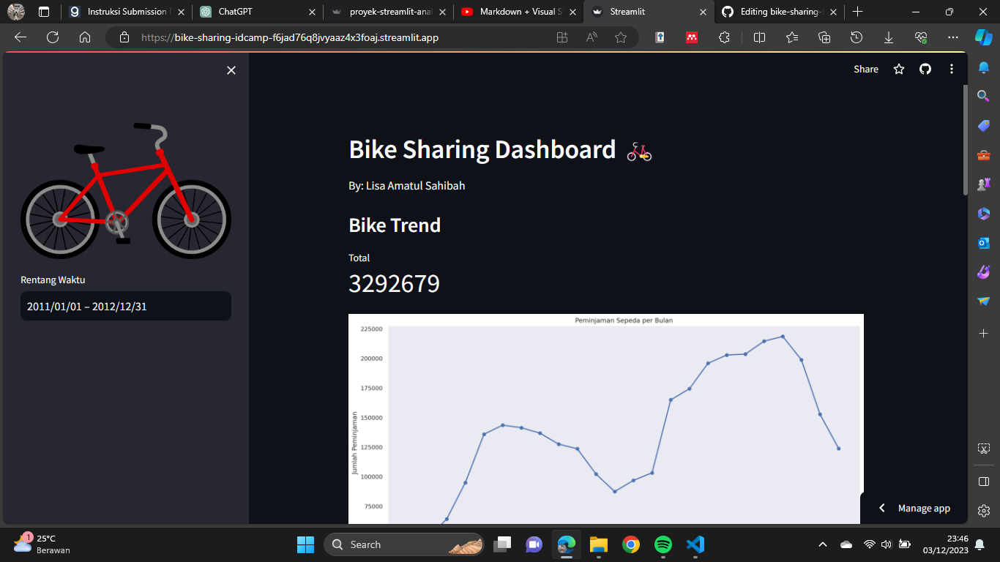

# Bike Sharing Dashboard :bike:

## Setup Environment 

`conda activate main-ds`

`pip install numpy pandas matplotlib seaborn streamlit babel`

## Run Streamlit App

`streamlit run proyek-streamlit-analisis-data.py`

## Link Dashboard
Link untuk dashboard bisa diakses [disini.](https://bike-sharing-idcamp-f6jad76q8jvyaaz4x3foaj.streamlit.app/)

## Screenshot Dashboard

